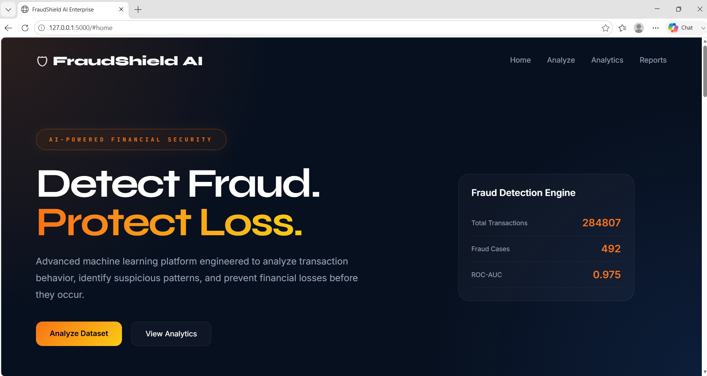
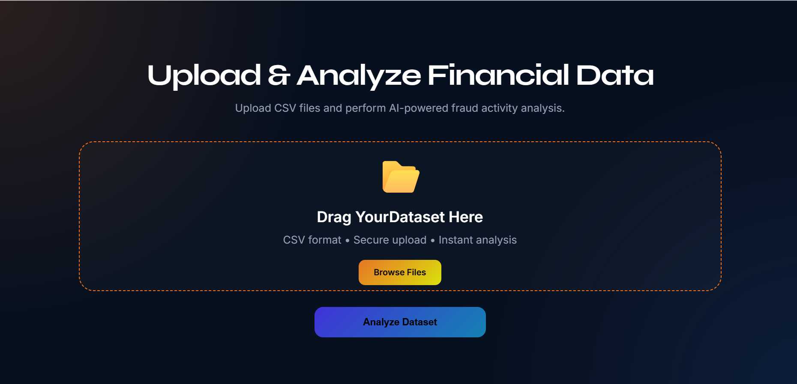
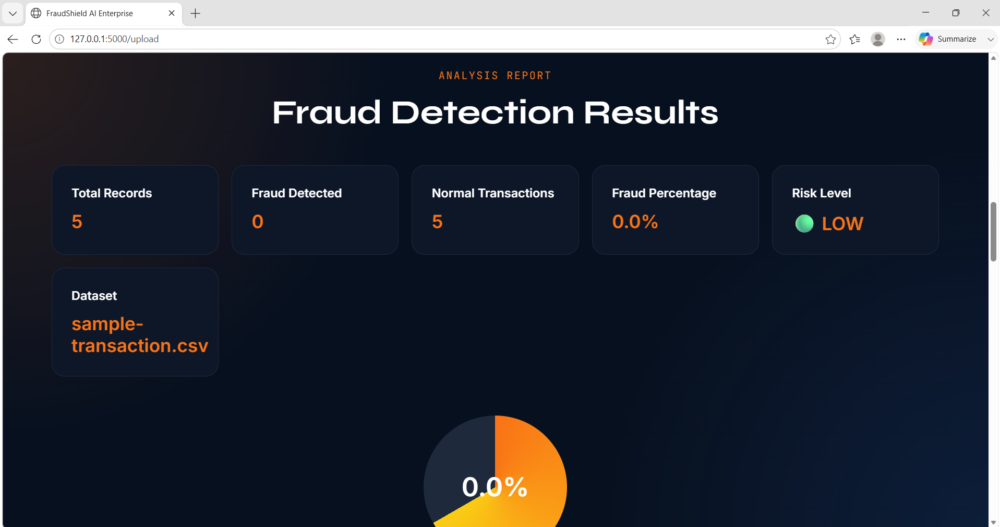

# 🛡 FraudShield AI

<div align="center">

### AI-Powered Credit Card Fraud Detection Platform

Detect fraudulent transactions, analyze financial datasets, and generate intelligent risk insights using Machine Learning.


</div>

---

# 📌 Project Overview

FraudShield AI is a modern fraud detection platform that leverages Machine Learning to identify suspicious credit card transactions.

The application enables users to upload transaction datasets, perform fraud analysis in real-time, visualize results through interactive dashboards, and generate downloadable reports.

Designed with a professional fintech-inspired interface, FraudShield AI demonstrates the practical application of Artificial Intelligence in financial security systems.

---

# 🚀 Key Features

### 🤖 Machine Learning Fraud Detection

- Random Forest Classifier
- Fraud Probability Prediction
- Risk Level Assessment
- High ROC-AUC Performance

### 📂 Dataset Analysis

- CSV Upload Support
- Automated Transaction Screening
- Fraud Percentage Calculation
- Batch Dataset Processing

### 📊 Interactive Analytics

- Fraud Distribution Visualization
- Model Performance Metrics
- Confusion Matrix Analysis
- Comparative Model Evaluation

### 🎨 Professional User Interface

- Modern FinTech Design
- Responsive Layout
- Interactive Dashboard
- Real-Time Analysis Experience

---

# 🧠 Machine Learning Pipeline

```text
Dataset Collection
        ↓
Data Preprocessing
        ↓
Train-Test Split
        ↓
Random Forest Training
        ↓
Model Evaluation
        ↓
Fraud Prediction Engine
        ↓
Web Application Deployment
```

---

# 📈 Model Performance

| Metric | Score |
|----------|----------|
| ROC-AUC | 0.975 |
| Precision | 0.86 |
| Recall | 0.84 |
| F1 Score | 0.85 |

### Confusion Matrix

| | Predicted Normal | Predicted Fraud |
|----|----|----|
| Actual Normal | 56855 | 9 |
| Actual Fraud | 21 | 77 |

The model achieves excellent fraud detection capability while maintaining a low false-positive rate.

---

# 🏗 System Architecture

```text
User
 │
 ▼
Flask Web Application
 │
 ▼
CSV Dataset Upload
 │
 ▼
Fraud Prediction Engine
 │
 ▼
Random Forest Model
 │
 ▼
Fraud Analysis Dashboard
 │
 ▼
Report Generation
```

---

# 🛠 Technology Stack

## Frontend

- HTML5
- CSS3
- JavaScript
- Chart.js

## Backend

- Flask
- Python

## Machine Learning

- Scikit-Learn
- Pandas
- NumPy
- Imbalanced-Learn (SMOTE)

## Data Visualization

- Matplotlib
- Seaborn

---

# 📂 Project Structure

```text
FraudShield-AI
│
├── dataset
│   └── creditcard.csv
│
├── model
│   └── fraud_model.pkl
│
├── notebooks
│   ├── evaluation.py
│   ├── eda.py
│
├── static
│   ├── style.css
│   ├── confusion_matrix.png
│   ├── model_comparison.png
│   ├── fraud_distribution.png
│   ├── amount_distribution.png
│   └── correlation_heatmap.png
│
├── templates
│   └── index.html
│
├── app.py
├── train_model.py
├── evaluation.py
├── model_comparison.py
├── fraud_results.csv
├── sample_transaction.csv
├── requirements.txt
└── README.md
```

---

# 🎥 Demo Video

Experience FraudShield AI in action.

▶ **Watch Demo:**  

[![Demo Video]https://drive.google.com/file/d/1Rr1_B_9coTU-jkjD2YrhphkNiNkT-M8i/view?usp=sharing]

---

## 📹 Quick Walkthrough

The demonstration showcases:

- Professional FinTech-inspired dashboard
- CSV transaction dataset upload
- AI-powered fraud detection
- Fraud percentage and risk analysis
- Interactive analytics dashboard
- Machine Learning model performance
- Downloadable fraud reports

---

## 🎬 Video Preview

Click the thumbnail below to watch the full demonstration.

https://drive.google.com/file/d/1Rr1_B_9coTU-jkjD2YrhphkNiNkT-M8i/view?usp=sharing
# 📸 Screenshots

## Landing Page



---

## Analytics Dashboard



---

## Fraud Analysis Results



---

# ⚙ Installation

## Clone Repository

```bash
git clone https://github.com/nithyasree457/FraudShield-AI.git
```

## Navigate to Project

```bash
cd FraudShield-AI
```

## Install Dependencies

```bash
pip install -r requirements.txt
```

## Run Application

```bash
python app.py
```

Open:

```text
http://127.0.0.1:5000
```

---

# 📊 Dataset Information
Note: The original dataset is not included in this repository due to GitHub file size limitations. Users can download the dataset from the source and place it in the `dataset/` folder.
The project uses the Credit Card Fraud Detection Dataset.

Dataset Characteristics:

- Total Transactions: 284,807
- Fraudulent Transactions: 492
- Features: 30+
- Highly Imbalanced Dataset

The dataset contains anonymized transaction features and is widely used for fraud detection research.

---
# 📌 Project Impact

FraudShield AI demonstrates how Machine Learning can be applied to real-world financial security challenges.

Key achievements:

- Achieved 97.5% ROC-AUC using Random Forest Classifier
- Successfully detected fraudulent transactions in highly imbalanced datasets
- Built a full-stack web application integrating Machine Learning and Data Analytics
- Designed a professional fintech-inspired dashboard for fraud monitoring and analysis
---

# 🎯 Future Enhancements

- Deep Learning Models
- XGBoost Integration
- Real-Time API Predictions
- Live Fraud Monitoring
- Cloud Deployment
- User Authentication System
- Database Integration
- Email Alert System

---

# 🌟 Project Highlights

✅ Professional FinTech Dashboard

✅ Machine Learning Powered Fraud Detection

✅ Interactive Analytics & Visualization

✅ CSV Dataset Upload Support

✅ Downloadable Fraud Reports

✅ Responsive Modern UI

✅ Production-Ready Architecture

---

# 👨‍💻 Developer

### Nithya Sree

AI & Machine Learning Developer | Data Science Enthusiast

Focused on building intelligent systems, data-driven applications, and real-world Machine Learning solutions that solve practical business problems.

---
## 🔥 Highlights

- 🎯 97.5% ROC-AUC Fraud Detection Model
- 📂 CSV Dataset Upload & Analysis
- 📊 Interactive Analytics Dashboard
- 🤖 Random Forest Machine Learning Model
- 📈 Fraud Distribution & Performance Visualizations
- 🎨 Modern FinTech-Inspired User Interface
---
# 📜 License

This project is intended for educational and portfolio purposes.

## ⭐ If you found this project useful, consider giving it a star.
